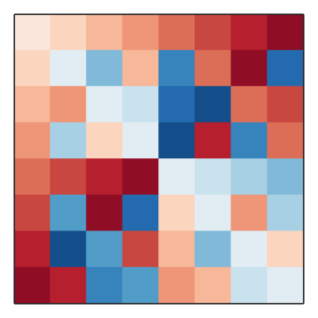
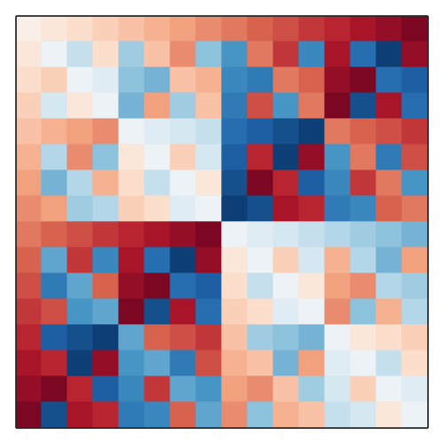
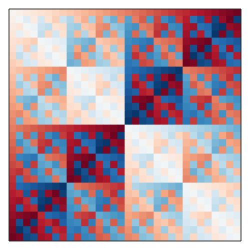
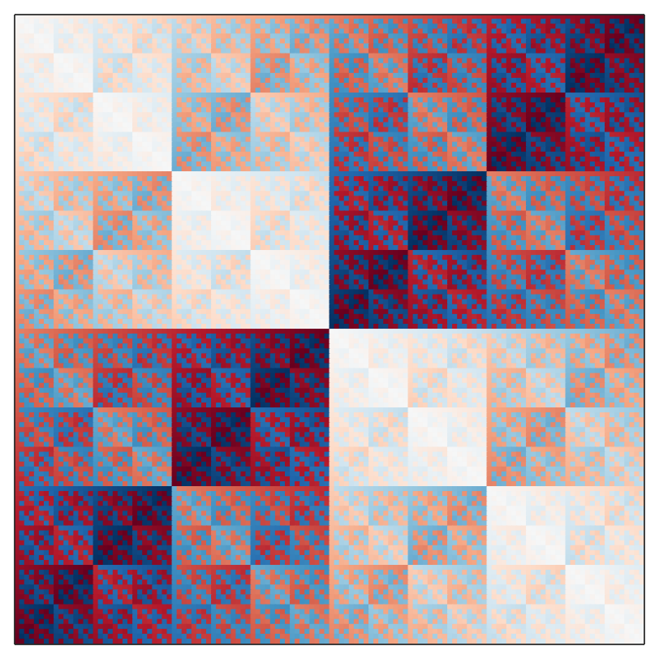

# Cayley Dickson
*Author*: [Travis Hoppe](http://thoppe.github.io/)

Implementation of the [Cayley-Dickson](http://en.wikipedia.org/wiki/Cayley%E2%80%93Dickson_construction) process in python. Requires `pandas`, and `numpy` to create the multiplication tables and `seaborn` to visualize. 

## Visualization
We can visualize the multipication tables with a diverging colormap. Red values are positive, blue values are negative. For example, with the complex numbers `1 => least red`, `i => most red`, `-1 => least blue`, `-i => most blue`.

### Complex numbers
A [complex number](http://en.wikipedia.org/wiki/Complex_number) is a number that can be expressed in the form `a + bi`, where `a` and `b` are real numbers and `i` is the imaginary unit. They are a normed division algebra over the real numbers. There is no natural linear ordering on the set of complex numbers.

### Quaternions
[Quaternions](http://en.wikipedia.org/wiki/Quaternion) are a normed division algebra over the real numbers. They are noncommutative. The unit quaternions can be thought of as a choice of a group structure on the 3-sphere S3 that gives the group Spin(3), which is isomorphic to SU(2) and also to the universal cover of SO(3).

### Octonions
The [octonions](http://en.wikipedia.org/wiki/Octonion) are a normed division algebra over the real numbers. They are noncommutative and nonassociative, but satisfy a weaker form of associativity, namely they are alternative.

### Sedenions
The [sedenions](http://en.wikipedia.org/wiki/Sedenion) form a 16-dimensional noncommutative and nonassociative algebra over the reals obtained by applying the Cayley–Dickson construction to the octonions.

### Trigintaduonions (32ions)

### Sexagintaquatronions (64ions)

### Centumduodetrigintanions (128ions)

### Ducentiquinquagintasexions (256ions)
_not computed yet_

